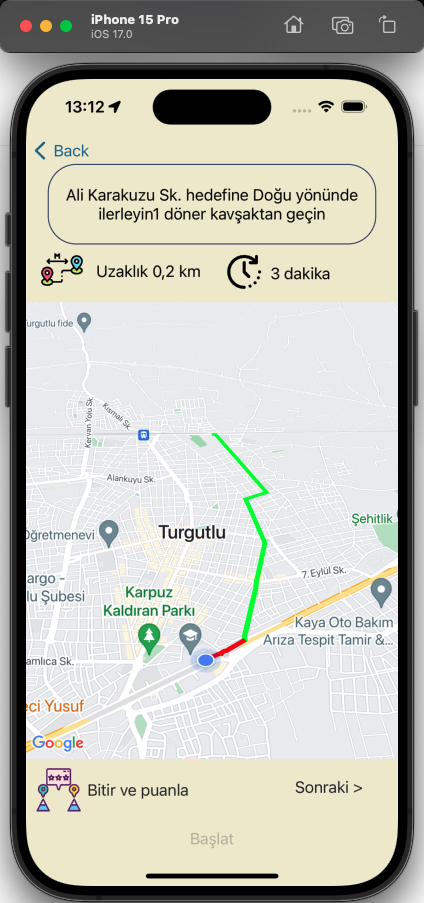

# Bisiklet Uygulaması

## 1. Proje Gereksinimleri

### 1.1. Giriş

#### 1.1.1. Hedef

Bu proje, bisiklet kullanıcılarının keyifli ve rahat bir şekilde ulaşım sağlamalarını amaçlamaktadır. Aynı zamanda, bisiklet etkinlikleri, hava durumu, bisiklet yolları gibi bilgileri kullanıcılara hızlı ve etkin bir şekilde sunarak sağlıklı ve çevreye faydalı bir ulaşım tercihi olan bisiklet kullanımını artırmayı hedeflemektedir.

## 2. Proje Detayları

- **Platform**: Xcode
- **Programlama Dili**: Swift
- **Kullanılan Kütüphaneler**: Google Maps SDK, Firebase Realtime Database
- **API'ler**: Routes API, Directions API, Places API

## 3. Modüller

### 3.1. Kullanıcı İşlemleri

- **Kullanıcı Kayıt Modülü**
- **Kullanıcı Sisteme Giriş Modülü**
- **Kullanıcı Sistemden Çıkış Modülü**

### 3.2. Rota İşlemleri

- **Rota Oluşturma Modülü**
- **Oluşturulan Rota Yönlendirme Modülü**
- **Oluşturulan Rota Kaydetme Modülü**
- **Oluşturulan Rota Gösterme Modülü**

### 3.3. Ek Fonksiyonlar

- **Kullanıcının Yakınındaki Hastaneleri Gösterme Modülü**
- **Kullanıcının Yakınındaki Dükkanları Gösterme Modülü**
- **Kullanıcının Şarkı Listesi Görüntüleme ve Açma Modülü**
- **Kullanıcının Etkinlikleri Görüntüleme ve Açma Modülü**

## 4. Ekran Görüntüleri

### Ana Sayfa ve Kayıt Ekranı
<table>
  <tr>
    <td></td>
    <td></td>
  </tr>
</table>

### Aktivite Listesi ve Detayı
<table>
  <tr>
    <td></td>
    <td></td>
     <td></td>
    <td></td>
  </tr>
</table>

### Rota İşlemleri
<table>
  <tr>
    <td></td>
    <td></td>
    <td></td>
     <td></td>
     <td></td>
  </tr>
  ### Kaydedilen Rotayı Görme Ekranı
  <tr>
    <td></td>
     <td></td>
  </tr>
</table>

### Diğer Özellikler
<table>
  <tr>
    <td></td>
    <td></td>
  </tr>
  <tr>
    <td></td>
    <td></td>
  </tr>
  <tr>
    <td></td>
    <td></td>
  </tr>
</table>

## 5. Kullanım

1. Uygulamayı başlatın.
2. Gerekli izinleri verin.
3. Uygulama içinde gezinin ve istediğiniz işlemleri gerçekleştirin.

